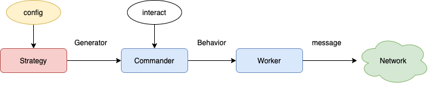

# 1. 概述

拜占庭测试是通过模拟恶意攻击行为对系统进行安全性和稳定性测试。
对于区块链这样的分布式系统，节点是通过对外发送/不发送消息来对系统施加影响的。
因此通过控制消息的发送时间、内容、数量和接收方，我们就可以模拟出任意的恶意行为。
考虑到这些控制因素理论上可以组合出无穷多的恶意行为，而我们无法穷尽所有的可能，
所以在具体实现时一方面是通过随机组合来覆盖尽可能多的可能，另一方面要方便随时增加新的测试用例。
后者会在[架构设计](#3-架构设计)部分做详细的解释。

在`muta`系统中，可以将节点发送的消息分为`主动消息`和`被动消息`。
主动消息是指节点可以在任意时刻主动发起的消息，如发送新交易，提案，投票等。
被动消息是指节点需要被其他消息触发才能发起的消息，
比如节点在收到 `pull_txs` 的时候才会发送 `push_txs`。
本项目的核心思路就是精心构造许多不同的恶意消息类型，
再与其他因素随机组合，以模拟出能够覆盖大部分场景的恶意行为。

# 2. 测试操作

首先根据测试需要，修改配置文件 `byzantine/generatoes.toml`，增加或删除某些测试用例。
```
interval = 500  // 主动消息的触发间隔，单位 ms

[[list]]
req_end = "/gossip/consensus/signed_proposal"    // 主动消息需忽略该项，被动消息填触发消息的 end
msg_type = { RecvProposal = "InvalidHeight" }    // 消息内容的类型
probability = 0.2         // 每次被触发时，生成该类型消息的概率，最大 1.0，表示 100%
num_range = [1, 10]       // 消息数量的取值范围，实际数量从该范围内随机生成
priority = "Normal"       // 消息发送的优先级，目前只有 Normal 和 High 两个选项
```
测试命令
```
// 启动三个正常节点
muta$ CONFIG=examples/config-1.toml GENESIS=examples/genesis.toml cargo run --release --example muta-chain
muta$ CONFIG=examples/config-2.toml GENESIS=examples/genesis.toml cargo run --release --example muta-chain
muta$ CONFIG=examples/config-3.toml GENESIS=examples/genesis.toml cargo run --release --example muta-chain
// 启动一个拜占庭节点
muta$ CONFIG=examples/config-4.toml GENESIS=examples/genesis.toml cargo run --release --example byzantine_node
```

# 3. 架构设计

核心需求 1. 方便随时增加新的测试用例；2.提供未来可通过外部交互控制和组织编排恶意攻击的能力。

为了实现以上需求，将恶意消息的生成过程抽象成以下三个过程

1. 配置文件 -> 行为生成器，由 `strategy` 模块实现
```rust
pub struct BehaviorGenerator {
    pub req_end:     Option<String>,  
    pub msg_type:    MessageType,
    pub probability: f64,   
    pub num_range:   (u64, u64),
    pub priority:    Priority,
}
```

2. 行为生成器 -> 行为，由 `commander` 模块实现
```rust
pub struct Behavior {
    pub msg_type: MessageType,
    pub msg_num:  u64,
    pub request:  Option<Request>,  // 主动消息为 None, 被动消息为触发消息的内容
    pub send_to:  Vec<Bytes>,
    pub priority: Priority,
}
```

3. 行为 -> 消息，由 `worker` 模块实现

由于通过配置生成的消息具有很强的随机性且无法从外部进行操纵，因此若未来有更加针对性的测试需求时，
可以增加交互功能，通过交互命令指导 `commander` 模块触发特定的 `Behavior`。



# 4. 文件列表
```
byzantine
├── src
│   ├── behaviors.rs           # 定义 Behavior 和各种消息类型
│   ├── commander.rs           # 根据 BehaviorGenerator 生成 Behavior
│   ├── config.rs              # 定义配置文件的数据结构
│   ├── default_start.rs       # 启动逻辑
│   ├── invalid_types.rs       # 生成各种恶意消息的方法实现
│   ├── lib.rs                 
│   ├── message.rs             # 将被动消息的触发消息传递给 commander
│   ├── strategy.rs            # 根据配置文件生成 BehaviorGenerator
│   ├── utils.rs               # 工具方法
└── └── worker.rs              # 根据 Behavior 生成和发送消息
```
