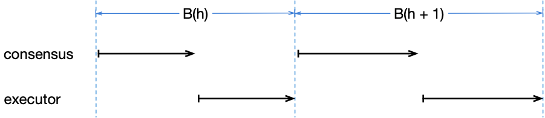
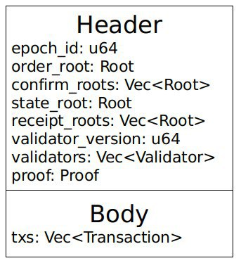
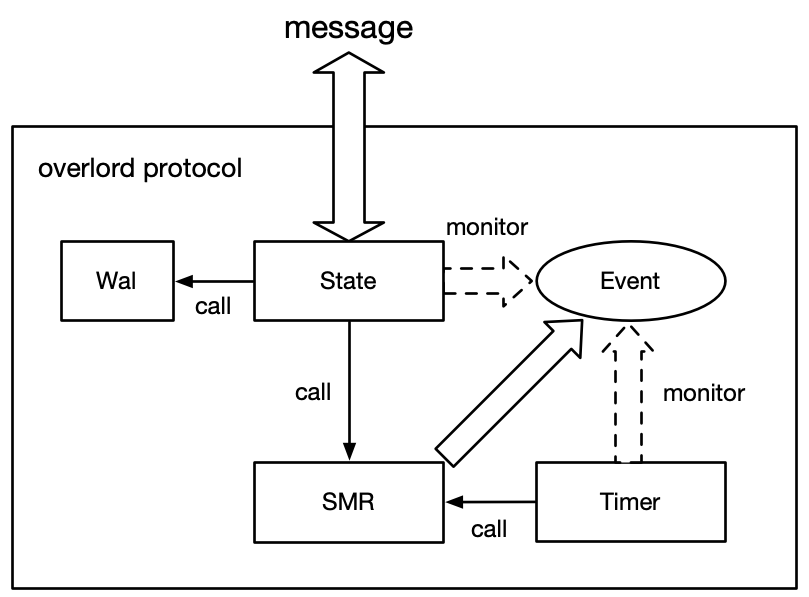
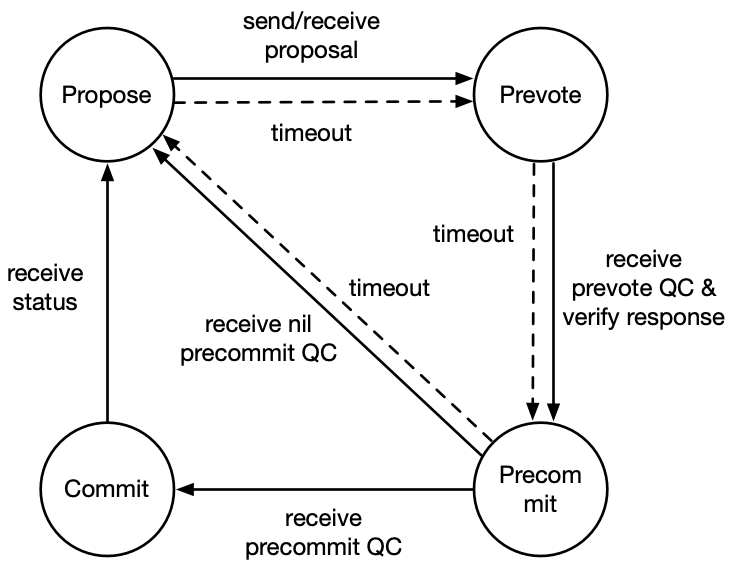

# Overlord

### Goal

Overlord is a Byzantine fault tolerance (BFT) consensus algorithm aiming to support thousands of transactions per second under hundreds of consensus nodes, with transaction delays of no more than a few seconds. Simply put, it is a high-performance consensus algorithm able to meets most of the real business needs.

### Background

Usually, a consensus process consists of at least two layers of semantics:

1. Complete the transaction sequencing 
2. Achieve consensus on the latest state

For the blockchain of the UTXO model, the new state is implicit in the transaction output, so 1 and 2 are integral and inseparable. For the blockchain of the Account model, the transaction does not contain the state, and only after the transaction is executed can the latest state be generated and the state is saved in an independent MPT tree.

For the Account model, in order to implement the second semantic, the common method is to let the consensus nodes execute all the transactions firstly. In this step, the latest state could be calculated and be saved to the block header. And then, consensus node will broadcast the block in which the transaction is sequenced.  Once the consensus is achieved,  the state and the transaction sequence is determined among all the nodes.  
However, this method restricts the transaction processing capability of the BFT-like consensus algorithm. As shown in the figure below, Only after the block B(h)(h means the block height) reaches a consensus, the new leader can pack and execute B（h+1），and then broadcast B(h+1). After receiving B(h+1), other consensus nodes need to execute B(h+1) again to verify its correctness. So, in this process, these two serial block execution processes slowed down the consensus efficiency.

<div align=center></div>

An improved method is that the Leader does not execute the block immediately after packing the new block. After the block reaches a consensus, the consensus node executes the block to generate a new state, and the next height leader will pack this state and the next height blocks together to participate in the next consensus process. This method saves one block execution process time.

When examining this improvement from a more microscopic perspective, we found that there is still much room for improvement. This is because the consensus module and the execution module of any consensus node are always serial throughout the consensus process. As shown in the figure above, when the consensus module runs, the execution module is always idle, and vice versa. If the execution module and the consensus module can be paralleled, the consensus transaction processing capability can theoretically reach the maximum processing limit of the execution module.


## Overlord Protocol

### Overview of the protocol

The core of Overlord is to decouple transaction sequence and state consensus.

We use B(h, S, T) to represent a block of height h, which contains a state of S, and the ordered transaction set is T. In the second semantic of consensus, people's interpretation of S is often the state after the execution of T， and this makes the execution module and consensus module impossible to parallel. If S is understood as the latest state in execution module execution in this moment, the consensus module will not have to wait for the execution module to execute the block. And the execution module only needs to execute forward. In this way, the consensus module can continuously advance, continuously ordering new transactions, and complete consensus on the latest state of the execution module; the execution module can also continuously execute the ordered transaction set until all the ordered transactions are executed.


### Protocol description


In Overlord, a consensus process is called a block. The block contains two parts, Header and Body (as shown below). The core structure of block is shown below, `height` is a monotonically increasing value, equivalent to height; `prev_hash` is the hash of the previous block; `order_root` is the merkle root of all pending transactions contained in the Body; `state_root` represents the latest world The MPT root of the state; `confirm_roots` represents the `order_root` collection from the `state_root` of the previous block to the `state_root` of the current block; the `receipt_roots` records the `receipt_root` corresponding to each `order_root` being executed; proof is proof of the previous block .

<div align=center></div>

In this method, the consensus module batches the transactions to make a consensus. After the consensus is reached, the ordered transaction set is added to the queue to be executed, and the execution module executes in order of the transaction set, and each execution of the transaction set is performed. The ordered root of the transaction set to be executed, and the executed stateRoot are sent to the consensus module. When packing the transactions to assemble the block, the leader take the latest state_root as the latest state to participate in the consensus.

Overlord is an interpretation layer above the specific consensus algorithm. By reinterpreting the semantics of consensus, the transaction sequence is decoupled from the state consensus, so that higher transaction processing capability can be obtained in actual operation. In theory, Overlord can be based on almost any BFT-like consensus algorithm, specifically in our project based on the improved Tendermint.

We have made three major improvements compared to Tendermint:

1. Apply the aggregate signature to Tendermint to make the consensus message complexity from  falls to , thus being able to support more consensus nodes
2. The propose transaction area is added to the proposal, so that the synchronization of the new transaction can be paralleled with the consensus process.
3. After receiving the proposal, the consensus node can vote for the prevote without waiting for the block check, and must obtain the block check result before voting the precommit vote, so that the block check is parallel with the prevote process.

#### Aggregate signature

In the Tendermint consensus protocol, the node casts a prevote on the proposal after it receives the proposal, and the prevote vote is broadcast to other nodes throughout the network. The communication complexity at this time is  Using aggregated signature optimization is the process by which all nodes send prevote votes to a specified Relayer node, which can be any consensus node. The Relayer node calculates the aggregated signature by the algorithm, and then uses a bitmap (bit-vec) to indicate which nodes vote. Send aggregated signatures and bitmaps to other nodes, for the same reason as precommit voting. This reduces the communication complexity to .

If Relayer fails, no aggregated signature is sent to the consensus node, or Relayer does evil, and only a small number of consensus nodes send aggregated signatures, the consensus will be inactivated. We use a time-out vote to solve this problem. When the node sends a prevote vote, it immediately sets a timer. If the prevoteQC is not received within the timeout period, it directly enters the pre-commit status, and the nil precommit vote is thrown. Then go to the next round. If the pre-voting phase is normal, a timer is also set after the precommit is sent. If the precommitQC is not received after the timeout, the next round is entered.

#### Synchronous parallelism

Overlord broadcasts CompactBlock in a compact block, meaning that its body contains only transaction hashes, not full transactions. After receiving the CompactBlock, the consensus node needs to synchronize all the complete transactions contained in its Body to construct a complete block.

In addition to the CompactBlock, we also added a propose trading area in the proposal. The pose contains the hash of the new transaction to be synchronized. It should be noted that these transactions do not overlap with the pending transaction hashes contained in CompactBlock. When CompactBlock is not sufficient to contain all new transactions in the trading pool, the remaining new transactions can be included in the proposed trading area for early synchronization. This can increase the degree of concurrency of transaction synchronization and consensus when the system transaction volume is large, and further improve transaction processing capability.

#### Verify parallelism

After receiving the *proposal*, the consensus node will verify the *CompactBlock* (to obtain the complete transaction and verify the correctness of the transaction) in parallel with the *prevote* vote. Only after receiving the *prevote* aggregate signature and the *CompactBlock* test result will the *precommit* be cast.

## Overlord architecture

The Overlord consensus consists of the following components:

* State Machine (SMR): State transition based on input messages
* State storage (State): used to store the status of the proposal, voting, etc.
* Timer: Set the timeout period to trigger the state machine operation
* Wal: used to read and write Wal logs

In the Overlord consensus architecture, when a message is received, the state storage module performs a basic check on the message. After passing, the status is updated according to the received message and the message is transmitted to the state machine. In addition, a timer is required to maintain activity, and when the timer expires, the timer calls the interface to trigger the state machine. The state machine will throw a current state event after making the state change. The state storage module and the timer module listen to the event thrown by the state machine, and perform corresponding processing according to the monitored event, such as writing Wal, sending a vote, setting the timing. And so on. At the time of the restart, the state storage module reads the data from the Wal and sends it to the state machine. The overall architecture is shown below:

<div align=center></div>

### Consensus State Machine (SMR)

The state machine module is the logical core of the entire consensus, and its main functions are state changes and *lock* control. When the received message is triggered, the status change is made according to the received message, and the changed status is thrown as an event. In our implementation, Overlord uses a Tendermint state machine that applies BLS aggregate signature optimization for consensus. The overall working process is as follows.

#### Prepare phase

The node uses a deterministic random algorithm to determine the leader of the current round.

*Leader*: Broadcast a proposal

*Others*: Set a timer T1 to send a *prevote* vote to *Relayer* when the proposal is received

#### Prevote step

*Relayer*: Set a timer T2 to aggregate the received *prevote* votes and generate a bitmap to broadcast the aggregated votes and bitmaps to other nodes.

*Others*: Set a timer T2, check the validity of the aggregated prevote vote, generate *PoLC* send precommit vote

####Verification step

All nodes set a timer T3. After receiving the verification result of the *proposal*, they enter the *pre-commit* stage.

#### Precommit step

*Relayer*: Set a timer T4 to aggregate the received precommit votes and generate a bitmap to broadcast the aggregated votes and bitmaps to other nodes.

*Others*: Set a timer T4 to check the legitimacy of the aggregated precommit vote

#### Commit step

All nodes commit the proposal

The state transition diagram of the consensus state machine is shown below:

<div align=center></div>

In the project, we combine the pre-voting phase and the verification phase into one phase, sharing a timeout. When the state machine receives the aggregated voting and verification results, it enters the pre-commit phase.

#### State Machine State

The states that the state machine module needs to store are:

* height: current consensus height
* round: round of current consensus
* step: the current stage
* proposal_hash: optional, current hash of consensus
* lock: optional, whether it has been reached *PoLC*

#### data structure

The trigger structure of the state machine is as follows:

```rust
pub struct SMRTrigger {
    pub hash: Hash,
    pub round: Option<u64>,
    pub trigger_type: TriggerType,
}
```

The output structure of the state machine is as follows:

```rust
pub enum SMREvent {
    /// New round event
    /// for state: update round,
    /// for timer: set a propose step timer.
    NewRoundInfo {
        round: u64,
        lock_round: Option<u64>,
        lock_proposal: Option<Hash>,
    },
    /// Prevote event,
    /// for state: transmit a prevote vote,
    /// for timer: set a prevote step timer.
    PrevoteVote(Hash),
    /// Precommit event,
    /// for state: transmit a precommit vote,
    /// for timer: set a precommit step timer.
    PrecommitVote(Hash),
    /// Commit event
    /// for state: do commit,
    /// for timer: do nothing.
    Commit(Hash),
    /// Stop event,
    /// for state: stop process,
    /// for timer: stop process.
    Stop,
}
```

#### State Machine Interface

```rust
/// Create a new SMR service.
pub fn new() -> Self
/// Trigger a SMR action.
pub fn trigger(&self, gate: SMRTrigger) -> Result<(), Error>
/// Goto a new consensus height.
pub fn new_height(&self, height: u64) -> Result<(), Error>
```

### State storage (State)

The state storage module is the functional core of the entire consensus. The main functions are storage state, message distribution, block, and cryptography related operations. In the working process, for the message transmitted by the network layer, the first check is performed to verify the validity of the message. Determine whether the written message needs to be written to Wal. The message is then sent to the state machine. The state storage module constantly listens for events thrown by the state machine and processes them accordingly.

#### Storage Status

The state that the state storage module needs to store include:

* height: current consensus height
* round: round of current consensus
* proposals: cache current height all offers
* votes: cache current height all votes
* QCs: Cache current height all QC
* authority_manage: consensus list management
* is_leader: whether the node is a leader
* proof: optional, proof of the last height
* last_commit_round: optional, the last round of submissions
* last_commit_proposal: Optional, last submitted proposal

#### Message Distribution

When sending a message, choose how to send the message based on the message and parameters (broadcast to other nodes or sent to Relayer).

#### Block

When the state storage module listens to the NewRound event thrown by the state machine, it determines whether it is a block node by a deterministic random number algorithm. If it is a block node, a proposal is made.

Deterministic random number algorithm: Because the Overlord consensus protocol allows different out-of-block weights and voting weights to be set, when determining the block, the node normalizes the block weights and projects them into the entire u64 range, using the current height and The sum of round is used as a random number seed to determine which of the u64 ranges the generated random number falls into, and the node corresponding to the weight is the outbound node.

#### Cryptography

Cryptographic operations include the following methods:

* When the message is received, the signature of message need to be verified
* When receiving the aggregate vote, verify the signature and check whether the weight exceeds the threshold
* Sign the message when making a proposal or voting
* When you are a Relayer, aggregate the votes you receive.

#### Status Storage Interface

### Timer

When the state machine runs to certain states, it needs to set a timer to perform operations such as timeout retransmission. The timer module listens for events thrown by the state machine and sets the timer based on the event. When the timeout period is reached, the interface of the calling state machine module triggers a timeout. The timer is multiplexed with the state store SMREvent and interface.

### Wal

In the consensus process, some messages need to be written to Wal. When restarting, the state storage module first reads the message from Wal and replies to the state before the restart. The Wal module only interacts with the state storage module.

#### Wal Interface

```rust
/// Save wal information.
pub async fn save(&self, info: Bytes) -> Result<(), Error>;
/// Load wal information.
pub fn load(&self) -> Result<Option<Bytes>, Error>;
```

## Overlord Interface

### Consensus Interface

```rust
#[async_trait]
pub trait Consensus<T: Codec>: Send + Sync {
    /// Get a block of an height and return the block with its hash.
    async fn get_block(
        &self,
        _ctx: Vec<u8>,
        height: u64,
    ) -> Result<(T, Hash), Box<dyn Error + Send>>;

    /// Check the correctness of a block. If is passed, return the integrated transcations to do
    /// data persistence.
    async fn check_block(
        &self,
        _ctx: Vec<u8>,
        height: u64,
        hash: Hash,
    ) -> Result<(), Box<dyn Error + Send>>;

    /// Commit a given block to execute and return the rich status.
    async fn commit(
        &self,
        _ctx: Vec<u8>,
        height: u64,
        commit: Commit<T>,
    ) -> Result<Status, Box<dyn Error + Send>>;

    /// Get an authority list of the given height.
    async fn get_authority_list(
        &self, 
        _ctx: Vec<u8>, 
        height: u64
    ) -> Result<Vec<Node>, Box<dyn Error + Send>>;

    /// Broadcast a message to other replicas.
    async fn broadcast_to_other(
        &self,
        _ctx: Vec<u8>,
        msg: OutputMsg<T>,
    ) -> Result<(), Box<dyn Error + Send>>;

    /// Transmit a message to the Relayer, the third argument is the relayer's address.
    async fn transmit_to_relayer(
        &self,
        _ctx: Vec<u8>,
        addr: Address,
        msg: OutputMsg<T>,
    ) -> Result<(), Box<dyn Error + Send>>;
}
```

### Cryptography Interface

```rust
pub trait Crypto {
    /// Hash a message.
    fn hash(&self, msg: &[u8]) -> Hash;

    /// Sign to the given hash by private key.
    fn sign(&self, hash: Hash) -> Result<Signature, Box<dyn Error + Send>>;

    /// Aggregate signatures into an aggregated signature.
    fn aggregate_signatures(
        &self,
        signatures: Vec<Signature>,
    ) -> Result<Signature, Box<dyn Error + Send>>;

    /// Verify a signature.
    fn verify_signature(
        &self,
        signature: Signature,
        hash: Hash,
    ) -> Result<Address, Box<dyn Error + Send>>;
    
    /// Verify an aggregated signature.
    fn verify_aggregated_signature(
        &self,
        aggregate_signature: AggregatedSignature,
    ) -> Result<(), Box<dyn Error + Send>>;
}
```
