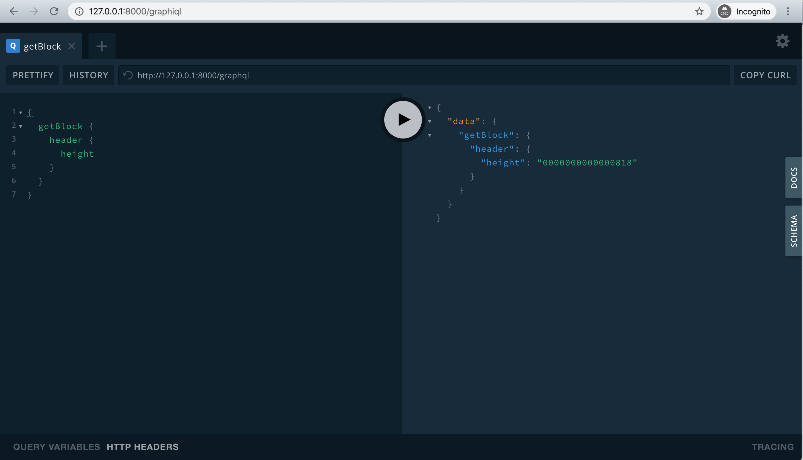

# Muta 入门

<details>
  <summary><strong>Table of Contents</strong></summary>

- [Muta 入门](#muta-%e5%85%a5%e9%97%a8)
  - [安装和运行](#%e5%ae%89%e8%a3%85%e5%92%8c%e8%bf%90%e8%a1%8c)
    - [安装依赖](#%e5%ae%89%e8%a3%85%e4%be%9d%e8%b5%96)
      - [** MacOS **](#macos)
      - [** ubuntu **](#ubuntu)
      - [** centos7 **](#centos7)
      - [** archlinux **](#archlinux)
    - [直接下载预编译的二进制文件](#%e7%9b%b4%e6%8e%a5%e4%b8%8b%e8%bd%bd%e9%a2%84%e7%bc%96%e8%af%91%e7%9a%84%e4%ba%8c%e8%bf%9b%e5%88%b6%e6%96%87%e4%bb%b6)
    - [从源码编译](#%e4%bb%8e%e6%ba%90%e7%a0%81%e7%bc%96%e8%af%91)
      - [获取源码](#%e8%8e%b7%e5%8f%96%e6%ba%90%e7%a0%81)
      - [安装 RUST](#%e5%ae%89%e8%a3%85-rust)
      - [编译](#%e7%bc%96%e8%af%91)
    - [运行单节点](#%e8%bf%90%e8%a1%8c%e5%8d%95%e8%8a%82%e7%82%b9)
  - [与链进行交互](#%e4%b8%8e%e9%93%be%e8%bf%9b%e8%a1%8c%e4%ba%a4%e4%ba%92)
    - [使用 GraphiQL 与链进行交互](#%e4%bd%bf%e7%94%a8-graphiql-%e4%b8%8e%e9%93%be%e8%bf%9b%e8%a1%8c%e4%ba%a4%e4%ba%92)
    - [使用 muta-cli 与链进行交互](#%e4%bd%bf%e7%94%a8-muta-cli-%e4%b8%8e%e9%93%be%e8%bf%9b%e8%a1%8c%e4%ba%a4%e4%ba%92)
  - [使用示例](#%e4%bd%bf%e7%94%a8%e7%a4%ba%e4%be%8b)
  - [使用 docker 本地部署多节点链](#%e4%bd%bf%e7%94%a8-docker-%e6%9c%ac%e5%9c%b0%e9%83%a8%e7%bd%b2%e5%a4%9a%e8%8a%82%e7%82%b9%e9%93%be)

  </details>

## 安装和运行

### 安装依赖

<!-- tabs:start -->

#### ** MacOS **

```
$ brew install autoconf libtool
```

#### ** ubuntu **

```
$ apt update
$ apt install -y git curl openssl cmake pkg-config libssl-dev gcc build-essential clang libclang-dev
```

#### ** centos7 **

```
$ yum install -y centos-release-scl
$ yum install -y git make gcc-c++ openssl-devel llvm-toolset-7

# 打开 llvm 支持
$ scl enable llvm-toolset-7 bash
```

#### ** archlinux **

```
$ pacman -Sy --noconfirm git gcc pkgconf clang make
```

<!-- tabs:end -->

### 直接下载预编译的二进制文件

我们会通过 [github releases](https://github.com/nervosnetwork/muta/releases) 发布一些常用操作系统的预编译二进制文件。如果其中包含你的操作系统，可以直接下载对应的文件。

### 从源码编译

#### 获取源码

通过 git 下载源码：

```
$ git clone https://github.com/nervosnetwork/muta.git
```

或者在 [github releases](https://github.com/nervosnetwork/muta/releases) 下载源码压缩包解压。

#### 安装 RUST

参考： <https://www.rust-lang.org/tools/install>

```
$ curl --proto '=https' --tlsv1.2 -sSf https://sh.rustup.rs | sh
```

#### 编译

```
$ cd /path/to/muta
$ make prod
```

编译完成后的二进制文件在 `target/release/muta`。

### 运行单节点

```
$ cd /path/to/muta

# 使用默认配置运行 muta
# 如果是直接下载的 binary，请自行替换下面的命令为对应的路径
./target/release/muta

# 查看帮助
$ ./target/release/muta  -h
muta v0.2.0
Muta Dev <muta@nervos.org>

USAGE:
    muta [OPTIONS]

FLAGS:
    -h, --help       Prints help information
    -V, --version    Prints version information

OPTIONS:
    -c, --config <FILE>     a required file for the configuration [default: ./config/chain.toml]
    -g, --genesis <FILE>    a required file for the genesis [default: ./config/genesis.toml]
```

## 与链进行交互

链默认在 8000 端口暴露了 GraphQL 接口用于用户与链进行交互。

### 使用 GraphiQL 与链进行交互

打开 <http://127.0.0.1:8000/graphiql> 后效果如下图所示：



左边输入 GraphQL 语句，点击中间的执行键，即可在右边看到执行结果。

点击右边 Docs 可以查阅接口文档。更多 GraphQL 用法可以参阅 [官方文档](https://graphql.org/)。

### 使用 muta-cli 与链进行交互

我们通过 [muta-sdk](./js_sdk) 和 nodejs 封装了一个交互式命令行，可以更方便的与 muta 进行交互。

```bash
$ npm install -g muta-cli

$ muta-cli repl
> await client.getLatestBlockHeight()
2081
> await client.getBlock('0x1')
{ header:
   { chainId:
      'b6a4d7da21443f5e816e8700eea87610e6d769657d6b8ec73028457bf2ca4036',
     confirmRoot: [],
     cyclesUsed: [ '0000000000000000' ],
     height: '0000000000000001',
     execHeight: '0000000000000000',
     orderRoot:
      '56e81f171bcc55a6ff8345e692c0f86e5b48e01b996cadc001622fb5e363b421',
     preHash:
      '87f07b8f60bd6198ba52deacfe9ecf9870198edb60a706a1d0fea1f5df1c6a26',
     proposer: 'f8389d774afdad8755ef8e629e5a154fddc6325a',
     receiptRoot: [],
     stateRoot:
      'f846a8c0af225b0d3a4ea5c90e2adfbf207b0accd9a1046832f84aa92947d1f1',
     timestamp: '000000005e3ebfea',
     validatorVersion: '0000000000000000',
     proof:
      { bitmap: '',
        blockHash:
         '56e81f171bcc55a6ff8345e692c0f86e5b48e01b996cadc001622fb5e363b421',
        height: '0000000000000000',
        round: '0000000000000000',
        signature: '' },
     validators: [ [Object] ] },
  orderedTxHashes: [] }
```

该 REPL 是基于 nodejs 的封装，你可以使用任何符合 nodejs 语法的语句。

环境中默认注入了一些变量，方便使用：
- `muta_sdk`: 即 muta-sdk 库，更多使用方法可以参考 [muta-sdk 文档](https://nervosnetwork.github.io/muta-sdk-js/)
- `muta`: muta 链的 instance
- `client`: 对链进行 GraphQL 调用的 client
- `wallet`: 根据助记词（默认为随机生成）推导出的钱包
- `accounts`: 根据 wallet 推导出的 20 个账号


## 使用示例

以下使用 muta-cli 对链的常用操作进行简单的示例说明：

```bash
$ muta-cli repl
# 链基础交互
> await client.getLatestBlockHeight()
2081

> client.getBlock('0x1')
{ header:
   { chainId:
      'b6a4d7da21443f5e816e8700eea87610e6d769657d6b8ec73028457bf2ca4036',
     confirmRoot: [],
     cyclesUsed: [ '0000000000000000' ],
     height: '0000000000000001',
     execHeight: '0000000000000000',
     orderRoot:
      '56e81f171bcc55a6ff8345e692c0f86e5b48e01b996cadc001622fb5e363b421',
     preHash:
      '87f07b8f60bd6198ba52deacfe9ecf9870198edb60a706a1d0fea1f5df1c6a26',
     proposer: 'f8389d774afdad8755ef8e629e5a154fddc6325a',
     receiptRoot: [],
     stateRoot:
      'f846a8c0af225b0d3a4ea5c90e2adfbf207b0accd9a1046832f84aa92947d1f1',
     timestamp: '000000005e3eecac',
     validatorVersion: '0000000000000000',
     proof:
      { bitmap: '',
        blockHash:
         '56e81f171bcc55a6ff8345e692c0f86e5b48e01b996cadc001622fb5e363b421',
        height: '0000000000000000',
        round: '0000000000000000',
        signature: '' },
     validators: [ [Object] ] },
  orderedTxHashes: [] }

# asset service 操作
> const account = accounts[0]

> const service = new muta_sdk.AssetService(client, account)

# 发行资产
> MT = await service.createAsset({name: 'Muta Token', supply: 1000000000, symbol: 'MT'})
{ name: 'Muta Token',
  symbol: 'MT',
  supply: 1000000000,
  issuer: '9d1d1bb11c44500603971a245f55a23f65148eee',
  asset_id:
   'e8c2c6606030bc93da018cec5e6400845489b471527d507357b3316ae884a3f3' }

# 发行者即为发交易的账户地址
> account.address
'0x9d1d1bb11c44500603971a245f55a23f65148eee'

# 查询发行者余额
> await client.queryService({serviceName: 'asset', method: 'get_balance', payload: JSON.stringify({asset_id: MT.asset_id, user: account.address})})
{ isError: false,
  ret:
   '{"asset_id":"e8c2c6606030bc93da018cec5e6400845489b471527d507357b3316ae884a3f3","user":"9d1d1bb11c44500603971a245f55a23f65148eee","balance":1000000000}' }

# 转账
> const to = accounts[1].address;

> await service.transfer({asset_id: MT.asset_id, to, value: 100});

# 查看转账结果
> await client.queryService({ serviceName: 'asset', method: 'get_balance', payload: JSON.stringify({asset_id: MT.asset_id, user: account.address})})
{ isError: false,
  ret:
   '{"asset_id":"e8c2c6606030bc93da018cec5e6400845489b471527d507357b3316ae884a3f3","user":"9d1d1bb11c44500603971a245f55a23f65148eee","balance":999999900}' }

> await client.queryService({ serviceName: 'asset', method: 'get_balance', payload: JSON.stringify({asset_id: MT.asset_id, user: to})})
{ isError: false,
  ret:
   '{"asset_id":"e8c2c6606030bc93da018cec5e6400845489b471527d507357b3316ae884a3f3","user":"9b13a4625e63b0c475c4a6f5dabb761d1c315f2b","balance":100}' }

# 链上管理
> admin = muta_sdk.Muta.account.fromPrivateKey('2b672bb959fa7a852d7259b129b65aee9c83b39f427d6f7bded1f58c4c9310c2')

> admin.address
'0xcff1002107105460941f797828f468667aa1a2db'

> metadata_raw = await client.queryService({serviceName: 'metadata', method: 'get_metadata', payload: ''})
{ isError: false,
  ret:
   '{"chain_id":"b6a4d7da21443f5e816e8700eea87610e6d769657d6b8ec73028457bf2ca4036","common_ref":"703873635a6b51513451","timeout_gap":20,"cycles_limit":99999999,"cycles_price":1,"interval":999,"verifier_list":[{"address":"f8389d774afdad8755ef8e629e5a154fddc6325a","propose_weight":1,"vote_weight":1}],"propose_ratio":15,"prevote_ratio":10,"precommit_ratio":10}' }

> metadata = JSON.parse(metadata_raw.ret)
{ chain_id:
   'b6a4d7da21443f5e816e8700eea87610e6d769657d6b8ec73028457bf2ca4036',
  common_ref: '703873635a6b51513451',
  timeout_gap: 20,
  cycles_limit: 99999999,
  cycles_price: 1,
  interval: 999,
  verifier_list:
   [ { address: 'f8389d774afdad8755ef8e629e5a154fddc6325a',
       propose_weight: 1,
       vote_weight: 1 } ],
  propose_ratio: 15,
  prevote_ratio: 10,
  precommit_ratio: 10 }
```

## 使用 docker 本地部署多节点链

需要预先安装 [docker](https://www.docker.com/)。

1. 构建 docker 镜像

```bash
cd /path/to/muta

make docker-build
```

2. 运行 docker compose 命令起链

```bash
docker compose -f devtools/docker-compose/bft-4-node.yaml up
```

Docker compose 启动 4 个共识节点，分别暴露 GraphQL 本地端口 8001、8002、8003、8004，节点的详细配置信息可前往 `devtools/docker-compose` 目录查看。