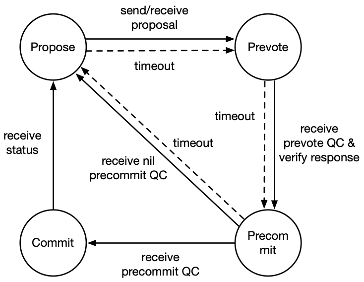

# Overlord 架构设计

- [目标](#目标)
- [设计背景](#设计背景)
- [Overlord 协议](#Overlord协议)
  - [总体设计](#总体设计)
  - [协议描述](#协议描述)
- [Overlord 架构](#Overlord架构)
  - [共识状态机](#共识状态机)
  - [状态存储](#状态存储)
  - [定时器](#定时器)
  - [Wal](#Wal)
- [Overlord 接口](#Overlord接口)
  - [共识接口](#共识接口)
  - [密码学接口](#密码学接口)

## 目标

Overlord 的目标是成为能够支持上百个共识节点，满足数千笔每秒的交易处理能力，且交易延迟不超过数秒的 BFT 共识算法。简单来讲，就是能够满足大部分现实业务需求的高性能共识算法。

## 设计背景

在区块链中，一次共识至少包含两层语义：

1. 完成交易定序
2. 对最新状态达成共识

对于 UTXO 模型的区块链来说，新状态隐含在交易输出中，因此 1 和 2 是一体不可分割的。而对于 Account 模型的区块链来说，交易中并没有包含状态，只有执行完交易才能生成最新状态，状态用单独的一颗 MPT 树保存。

在 Account 模型中，为了实现第二层语义，常用的办法是，共识节点在打包新区块之前执行完区块中的所有交易，以计算出最新状态保存到块头中。包含了最新状态的区块达成共识后，区块中的交易完成了定序，同时最新状态亦完成了共识，任何节点可以重放区块中的交易验证状态的正确性。然而，这种处理方法制约了 BFT 类共识算法的交易处理能力。如下图所示，当高度为 h 的区块 B(h) 达成共识后，高度为 h+1 的新 leader 打包并执行 B(h+1) 后才能广播 B(h+1)，其他共识节点收到 B(h+1) 后必须再执行 B(h+1) 以验证其正确性。在共识过程中，这两次串行的区块执行过程拖慢了共识效率。

<div align=center></div>

一种改进的办法是，Leader 在打包新区块时并不立即执行该块，待区块达成共识后，共识节点才执行该块生成新的状态，下一个高度的 Leader 将新状态与下一个区块一起参与共识。这种办法省掉了一次区块执行过程。

当从更微观的角度来审察这种改进方案时，我们发现其仍然存在很大的改进空间。这是因为，任何一个共识节点的共识模块和执行模块在整个共识过程中始终是串行的，如上图所示，当共识模块在对区块共识时，执行模块始终是空闲的，反之亦然。如果能够将执行模块和共识模块并行，那么共识的交易处理能力理论上能够达到执行模块的最大处理极限。

## Overlord 协议

### 总体设计

Overlord 的核心思想是解耦交易定序与状态共识。

我们用 B(h, S, T) 表示高度为 h 的区块，其包含的状态是 S，定序的交易集合是 T。在共识的第二层语义中，人们对 S 的解读往往是执行完 T 后的状态，正是这种思维定势使得执行模块和共识模块无法并行。如果将 S 理解为是共识模块在开始对 B(h, S, T) 共识时，执行模块执行达到的最新状态，那么共识模块将无需等待执行模块执行新的区块，而执行模块只需要沿着已定序的交易向前执行。这样，共识模块可以连续向前推进，不断将新交易定序，同时完成执行模块的最新状态共识; 执行模块也可以连续执行已定序的交易集合，直到将所有已定序的交易执行完毕。

### 协议描述

在 Overlord 中，我们将达成共识的区块称为 *block*。*block* 包含 Header 和 Body 两部分（如下图所示）。*block* 的核心结构如下图所示，`height` 是单调递增的数值，相当于高度；`prev_hash` 是上一个 *block* 的哈希；`order_root` 是包含在 Body 中的所有待定序的交易的 merkle root；`state_root` 表示最新的世界状态的 MPT Root；`confirm_roots` 表示从上一个 *block* 的 `state_root` 到当前 *block* 的 `state_root` 之间执行模块向前推进的 `order_root` 集合；`receipt_roots` 记录被执行的每一个 `order_root` 所对应的 `receipt_root`；`proof` 是对上一个 *block* 的证明。

> [!NOTE|style:flat]
> Overlord 是确定性共识，但是需要特别注意的是，区块头中所包含的 proof 是用来验证上一个块，而非当前区块。因此，对于最新区块而言，能证明其合法性的 proof 将被尚未出现的下一个区块包含，那么如何验证最新区块的合法性呢？实际上，诚实节点在将最新区块持久化之前，已经获得了对该区块的 proof 并进行了合法性验证，因此从诚实节点获取的最新区块是经过验证并且可以相信不会回滚的。

<div align=center></div>

在具体的方案中，共识模块批量打包交易进行共识, 达成共识后, 将已定序的交易集合添加到待执行的队列中, 执行模块以交易集合为单位依次执行, 每执行完一个交易集合, 就将被执行的交易集合的 order_root, 以及执行后的 stateRoot 发给共识模块。在 Leader 打包交易拼装 *block* 时, 取最新收到的 state_root 作为最新状态参与共识.

Overlord 是在具体共识算法之上的解释层, 通过重新诠释共识的语义, 使得交易定序与状态共识解耦, 从而在实际运行中获得更高的交易处理能力。理论上, Overlord 能够基于几乎任何 BFT 类共识算法, 具体在我们的项目中则是基于改进的 Tendermint。

我们对 Tendermint 主要做了三点改进：

1. 将聚合签名应用到 Tendermint 中, 使共识的消息复杂度从  降到 , 从而能够支持更多的共识节点
2. 在 *proposal* 中增加了 propose 交易区, 使新交易的同步与共识过程可并行
3. 共识节点收到 *proposal* 后, 无需等 *block* 校验通过即可投 *prevote* 票, 而在投 *precommit* 票之前必须得到 *block* 校验结果, 从而使得区块校验与 *prevote* 投票过程并行

#### 聚合签名

在 Tendermint 共识协议中，节点在收到 *proposal* 之后对其投出 *prevote*，*prevote* 投票是全网广播给其他节点的。这时的通信复杂度是 。使用聚合签名优化是所有的节点将 *prevote* 投票发给一个指定的 *Relayer* 节点，Relayer 节点可以是任何一个共识节点。Relayer 节点将收到的签名通过算法计算聚合签名，再用一个位图 (bit-vec) 表示是哪些节点的投票。将聚合签名和位图发送给其他节点，对于 *precommit* 投票同理。这样就将通信复杂度降到了 。

如果 *Relayer* 出现故障，没有发送聚合签名给共识节点，或者 *Relayer* 作恶，只给小部分共识节点发送聚合签名，那么共识将会失活。我们采用超时投空票的方式解决这个问题。当节点在投出 *prevote* 投票之后，立即设置一个定时器，如果的超时时间内没有收到 *prevoteQC* 直接进入预提交状态，投出 *nil precommit* 投票。之后进入到下一个 round。如果预投票阶段正常，投出 *precommit* 之后同样设置一个定时器，如果超时没有收到 *precommitQC* 则直接进入下一个 round。

#### 同步并行

Overlord 采用压缩区块（compact block）的方式广播 *CompactBlock*，即其 Body 中仅包含交易哈希，而非完整交易。共识节点收到 *CompactBlock* 后，需要同步获得其 Body 中包含的全部完整交易后才能构造出完整的 *block*。

我们在 proposal 里除了包含 *CompactBlock* 外，还额外增加了一个 *propose* *交易区，propose* 交易区中包含待同步的新交易的哈希。需要注意的是，这些交易与 *CompactBlock* 里包含的待定序的交易哈希并不重叠，当 *CompactBlock* 不足以包含交易池中所有的新交易时，剩余的新交易可以包含到 *propose* 交易区中提前同步。这在系统交易量很大的时候，可以提高交易同步与共识的并发程度，进一步提高交易处理能力.

#### 校验并行

共识节点收到 *proposal* 后，将 *CompactBlock* 的校验(获得完整交易，校验交易的正确性) 与 *prevote* 投票并行，只有当收到 *prevote* 聚合签名和 *CompactBlock* 的检验结果后，才会投 *precommit* 票。

## Overlord 架构

Overlord 共识由以下几个组件组成的：

* 状态机(SMR)：根据输入消息的进行状态转换

* 状态存储(State)：用于存储提议，投票等状态

* 定时器(Timer)：设定超时时间触发状态机操作

* Wal：用于读写 Wal 日志

在 Overlord 共识架构中，当收到消息时，状态存储模块先对消息做基本检查。通过后，根据接收到的消息更新状态，并将消息传输给状态机。此外，为了保持活性还需要一个定时器，当超时时定时器调用接口触发状态机。状态机在做状态变更之后会抛出一个当前状态的事件，状态存储模块和定时器模块监听状态机抛出的事件，根据监听到的事件做相应的处理，例如写 Wal，发送投票，设置定时器等。在重启时状态存储模块先从 Wal 中读取数据，再发送给状态机。整体的架构如下图所示：

<div align=center></div>

### 共识状态机(SMR)

状态机模块是整个共识的逻辑核心，它主要的功能是状态变更和 **lock** 的控制。当收到消息触发时，根据收到的消息做状态变更，并将变更后的状态作为事件抛出。在我们的实现中，Overlord 使用一个应用 BLS 聚合签名优化的 Tendermint 状态机进行共识，整体的工作过程如下。

#### 提议阶段

节点使用确定性随机算法确定本轮的 *Leader*。

**Leader**: 广播一个 *proposal*

**Others**: 设置一个定时器 T1，当收到 *proposal* 之后向 *Relayer* 发送 *prevote* 投票

#### 预投票阶段

**Relayer**: 设置一个定时器 T2，对收到的 *prevote* 投票进行聚合并生成位图，将聚合后的投票和位图广播给其他节点

**Others**: 设置一个定时器 T2，检查聚合的 *prevote* 投票的合法性，生成 **PoLC** 发送 *precommit* 投票

#### 校验等待阶段

所有节点设置一个定时器 T3，当收到对 *proposal* 的校验结果之后，进入预提交阶段

#### 预提交阶段

**Relayer**: 设置一个定时器 T4，对收到的 *precommit* 投票进行聚合并生成位图，将聚合后的投票和位图广播给其他节点

**Others**: 设置一个定时器 T4，检查聚合的 *precommit* 投票的合法性

#### 提交阶段

所有节点将 *proposal* 提交

共识状态机的状态转换图如下图所示：

<div align=center></div>
在工程中，我们将预投票阶段和校验等待阶段合并为一个阶段，共用一个超时时间。当状态机收到聚合后的投票和校验结果之后，进入到预提交阶段。

#### 状态机状态

状态机模块需要存储的状态有：

* *height*: 当前共识的高度

* *round*: 当前共识的轮次

* *step*: 当前所在的阶段

* *proposal_hash*: 可选，当前正在共识的哈希

* *lock*: 可选，当前是否已经达成 **PoLC**

#### 数据结构

状态机的触发结构如下：

```rust
pub struct SMRTrigger {
    pub hash: Hash,
    pub round: Option<u64>,
    pub trigger_type: TriggerType,
}
```

状态机的输出结构如下：

```rust
pub enum SMREvent {
    /// New round event
    /// for state: update round,
    /// for timer: set a propose step timer.
    NewRoundInfo {
        round: u64,
        lock_round: Option<u64>,
        lock_proposal: Option<Hash>,
    },
    /// Prevote event,
    /// for state: transmit a prevote vote,
    /// for timer: set a prevote step timer.
    PrevoteVote(Hash),
    /// Precommit event,
    /// for state: transmit a precommit vote,
    /// for timer: set a precommit step timer.
    PrecommitVote(Hash),
    /// Commit event
    /// for state: do commit,
    /// for timer: do nothing.
    Commit(Hash),
    /// Stop event,
    /// for state: stop process,
    /// for timer: stop process.
    Stop,
}
```

#### 状态机接口

```rust
/// Create a new SMR service.
pub fn new() -> Self
/// Trigger a SMR action.
pub fn trigger(&self, gate: SMRTrigger) -> Result<(), Error>
/// Goto a new consensus height.
pub fn new_height(&self, height: u64) -> Result<(), Error>
```

### 状态存储(State)

状态存储模块是整个共识的功能核心，主要的功能为存储状态，消息分发，出块和密码学相关操作。在工作过程中，对于网络层传输来的消息，首先进行验签，校验消息的合法性。对通过的消息判断是否需要写入 Wal。之后将消息发送给状态机。状态存储模块时刻监听状态机抛出的事件，并根据事件作出相应的处理。

#### 存储状态

状态存储模块需要存储的状态有：

* *height*: 当前共识的高度

* *round*: 当前共识的轮次

* *proposals*: 缓存当前高度的所有的提议

* *votes*: 缓存当前高度的所有的投票

* *QCs*: 缓存当前高度的所有的 *QC*

* *authority_manage*: 共识列表管理

* *is_leader*: 节点是不是 *leader*
  
* *proof*: 可选，上一个 block 的证明

* *last_commit_round*: 可选，上一次提交的轮次

* *last_commit_proposal*: 可选，上一次提交的提议

#### 消息分发

发送消息时，根据消息及参数选择发送消息的方式（广播给其他节点或发送给 *Relayer*）。

#### 出块

当状态存储模块监听到状态机抛出的 `NewRound` 事件时，通过一个确定性随机数算法判断自己是不是出块节点。如果是出块节点则提出一个 proposal。

*确定性随机数算法*：因为 Overlord 共识协议允许设置不同的出块权重和投票权重，在判断出块时，节点将出块权重进行归一化，并投射到整个 `u64` 的范围中，使用当前 `height` 与 `round` 之和作为随机数种子，判断生成的随机数落入到`u64` 范围中的哪一个区间中，该权重对应的节点即为出块节点。

#### 密码学操作

密码学操作包括如下方法：

* 收到消息时，对消息进行验签

* 收到聚合投票时，验签并校验权重是否超过阈值

* 发出提议或投票时，对消息进行签名

* 自己是 *Relayer* 时，对收到的投票进行聚合

#### 状态存储接口

### 定时器

当状态机运行到某些状态的时候，需要设定定时器以便超时重发等操作。定时器模块会监听状态机抛出的事件，根据事件设置定时器。当达到超时时间，调用状态机模块的接口触发超时。定时器与状态存储复用 `SMREvent` 和接口。

### Wal

在共识过程中，需要将一些消息写入到 Wal 中。当重启时，状态存储模块首先从 Wal 中读取消息，回复重启前的状态。Wal 模块只与状态存储模块交互。

#### Wal 接口

```rust
/// Save wal information.
pub async fn save(&self, info: Bytes) -> Result<(), Error>;
/// Load wal information.
pub fn load(&self) -> Result<Option<Bytes>, Error>;
```

## Overlord 接口

### 共识接口

```rust
#[async_trait]
pub trait Consensus<T: Codec>: Send + Sync {
    /// Get a block of an height and return the block with its hash.
    async fn get_block(
        &self,
        _ctx: Vec<u8>,
        height: u64,
    ) -> Result<(T, Hash), Box<dyn Error + Send>>;

    /// Check the correctness of a block. If is passed, return the integrated transcations to do
    /// data persistence.
    async fn check_block(
        &self,
        _ctx: Vec<u8>,
        height: u64,
        hash: Hash,
    ) -> Result<(), Box<dyn Error + Send>>;

    /// Commit a given block to execute and return the rich status.
    async fn commit(
        &self,
        _ctx: Vec<u8>,
        height: u64,
        commit: Commit<T>,
    ) -> Result<Status, Box<dyn Error + Send>>;

    /// Get an authority list of the given height.
    async fn get_authority_list(
        &self, 
        _ctx: Vec<u8>, 
        height: u64
    ) -> Result<Vec<Node>, Box<dyn Error + Send>>;

    /// Broadcast a message to other replicas.
    async fn broadcast_to_other(
        &self,
        _ctx: Vec<u8>,
        msg: OutputMsg<T>,
    ) -> Result<(), Box<dyn Error + Send>>;

    /// Transmit a message to the Relayer, the third argument is the relayer's address.
    async fn transmit_to_relayer(
        &self,
        _ctx: Vec<u8>,
        addr: Address,
        msg: OutputMsg<T>,
    ) -> Result<(), Box<dyn Error + Send>>;
}
```

### 密码学接口

```rust
pub trait Crypto {
    /// Hash a message.
    fn hash(&self, msg: &[u8]) -> Hash;

    /// Sign to the given hash by private key.
    fn sign(&self, hash: Hash) -> Result<Signature, Box<dyn Error + Send>>;

    /// Aggregate signatures into an aggregated signature.
    fn aggregate_signatures(
        &self,
        signatures: Vec<Signature>,
    ) -> Result<Signature, Box<dyn Error + Send>>;

    /// Verify a signature.
    fn verify_signature(
        &self,
        signature: Signature,
        hash: Hash,
    ) -> Result<Address, Box<dyn Error + Send>>;
    
    /// Verify an aggregated signature.
    fn verify_aggregated_signature(
        &self,
        aggregate_signature: AggregatedSignature,
    ) -> Result<(), Box<dyn Error + Send>>;
}
```